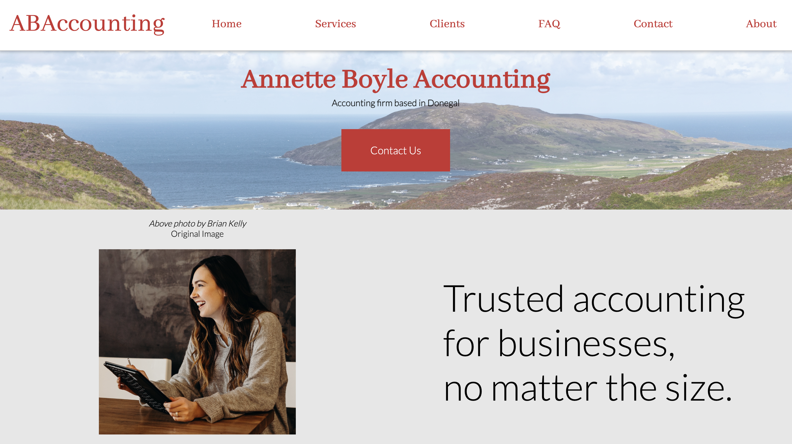

# ABAccounting-Website

This website was part of a Web Design assignment for one of my modules in University. The plan was to create a responsive webpage with 6 html pages of content which modelled a business/service - of which I chose my mums accounting business.

The websites design is that of my own in which I create layout designs, chose colours/general theme and created everything myself from the ground using just HTML, CSS and some JavaScript here and there. The website also includes a form which uses PHP to communicate to with a SQL server to store messages through XAMPP. While it is not suitable for production, it takes the general idea of my mum's practice and expands it to create a fully function and asthetic website.

## Webpages 

- Index/Homepage
- Services
- FAQ
- Clients
- Contact
- About

# How it looks

*Home Page example*

  
